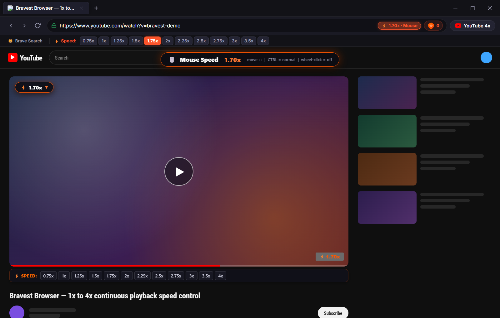
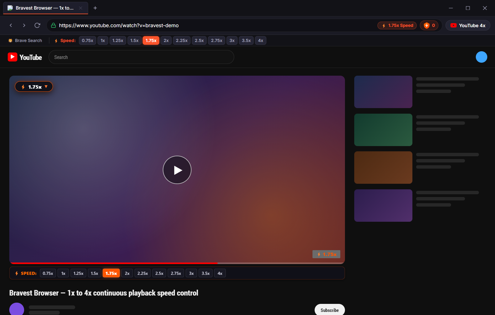

# 🦡 Bravest Browser

> A privacy-first **Brave Browser fork** with the full **Brave Shields** ad-blocking engine, a dedicated **single-tap 1x–4x playback speed toolbar**, brand-new **continuous mouse speed control** (lock on with a wheel-click and tune the speed by moving the mouse), Windows **Aero Snap** window management, and a matching **Android app** with a drag-and-hold speed bubble.


### 🔗 Downloads & Releases

* **💻 Windows Portable Executable**: [`Bravest.exe`](Bravest.exe) — also available as [`Bravest.lnk`](Bravest.lnk) shortcut
* **📱 Android APK (v1.2.0)**: [Download Bravest-Android-v1.2.0.apk](https://github.com/XNtriCT/Bravest/releases/download/v1.2.0/Bravest-Android-v1.2.0.apk)
* **🐙 GitHub Repository**: [https://github.com/XNtriCT/Bravest](https://github.com/XNtriCT/Bravest)

---

## 📸 Screenshots

### Speed toolbar + mouse speed control locked on at 1.70x
The wheel-click mouse speed control tunes the video continuously while the closest preset (`1.75x`) lights up as an approximate indicator.



### Single-tap speed toolbar with live active indicator
The 1x–4x speed bar sits directly below the URL bar. The active speed glows in Brave Orange, both in the browser toolbar and inside the YouTube player.



> Screenshots are generated from the real app UI via [`scripts/screenshots/capture.js`](scripts/screenshots/capture.js) (a local mock video page is used for deterministic captures).

---

## ✨ Features

- **🖱️ Continuous Mouse Speed Control (New)**:
  - **Wheel-click (middle-click) to lock on / off** while a video is playing.
  - Move the mouse **right to speed up** and **left to slow down** across a fully continuous **1x → 4x** range — no fixed steps, up to 0.01x precision.
  - Only the playback rate changes — the playhead is never touched or seeked.
  - The nearest preset button in the toolbar lights up as an approximate indicator (e.g. `1.70x` → `1.75x`).
  - **Hold `Ctrl`** to temporarily use the mouse normally (open links in a new tab, click, scroll) without leaving the lock mode.
  - Mouse wheel **scrolling keeps working normally**; only the wheel *click* is reserved while locked.
- **⚡ Linear Single-Tap Speed Toolbar (0.75x to 4x)**:
  - Instant one-tap speed buttons located directly below the URL bar: `0.75x`, `1x`, `1.25x`, `1.5x`, `1.75x`, `2x`, `2.25x`, `2.5x`, `2.75x`, `3x`, `3.5x`, `4x`.
  - Live active indicator: the closest speed glows in Brave Orange (`#fb542b`).
  - Extended keyboard shortcuts (`Shift + >` and `Shift + <`) scale smoothly up to **4x**.
  - Smooth audio pitch preservation (`preservesPitch = true`) keeping voices clear and natural.
  - Speed memory: remembers your preferred playback speed across sessions.
- **📱 Bravest for Android (v1.2.0)**:
  - Compact **speed selection bar on top**, directly below the URL space, matching the desktop web app.
  - Prominent **drag-and-hold speed bubble** (pulsing globule animation) docked between the *next* and *Brave Search* buttons.
  - Tap and hold the bubble, drag your finger anywhere on screen: **right = faster, left = slower**, fully continuous **1x → 4x**.
  - Release to deactivate and resume normal controls; the nearest top-bar preset lights up as the approximate indicator.
  - Full-screen live speed readout, haptic feedback, ad-skipping and background audio playback.
- **🦁 Full Brave Shields Engine**:
  - Blocks banner ads, tracking scripts, and popups.
  - Automatically strips YouTube video ads (pre-rolls and mid-rolls).
  - Real-time tracker & ad blocked counter in the Omnibox.
- **🪟 Windows Aero Snap & Window Management**:
  - Drag the browser window smoothly from anywhere across the titlebar.
  - Full Windows Aero Snap support: drag to top to maximize, drag to left/right screen edges to snap and pin side-by-side.
  - Double-click titlebar to toggle maximize and restore.
  - Standard edge and corner resizing with dynamic maximize/restore icon toggle.
- **🌐 Brave UI & Aesthetics**:
  - Modern Brave dark theme with orange accents and glassmorphism.
  - Multi-tab management with draggable tabs and fast keyboard navigation.
  - Omnibox with Brave Search integration.
  - Pop-ups requested by pages (middle-click / `target="_blank"`) open as **tabs in the same window**.

---

## 🖱️ How to Use Mouse Speed Control (Windows / Desktop)

1. Start playing any video.
2. **Click the mouse wheel** once to lock mouse speed control. A live HUD appears on the video.
3. Move the mouse **right to increase** and **left to decrease** the speed. The range is continuous from **1x** to **4x**.
4. Watch the top speed toolbar — the closest preset glows as an approximate indication.
5. **Hold `Ctrl`** at any time to use the mouse normally (selecting text, opening links with the wheel click, etc.).
6. **Click the mouse wheel again** to unlock and return to normal controls.

---

## 📱 Android App

The Android build ships the same speed engine with a touch-first control:

| Control | Action |
| :--- | :--- |
| **Top speed bar** | Single-tap any preset from `0.75x` to `4x` |
| **Speed pill (top bar)** | Steps up to the next preset, wraps at 4x |
| **Drag-and-hold bubble** | Hold the pulsing bubble and drag: right = faster, left = slower (continuous 1x–4x). Release to deactivate. |

Install the latest APK from the [releases page](https://github.com/XNtriCT/Bravest/releases/latest).

---

## ⌨️ Keyboard Shortcuts

| Shortcut | Action |
| :--- | :--- |
| **Mouse wheel click** | Lock / unlock continuous mouse speed control |
| **Hold `Ctrl`** | Temporarily use the mouse normally while locked |
| **`Shift` + `>`** | Increase playback speed (scales up to **4.0x**) |
| **`Shift` + `<`** | Decrease playback speed (scales down to **0.25x**) |
| **`Ctrl` + `T`** | Open new tab |
| **`Ctrl` + `W`** | Close current tab |
| **`Ctrl` + `L`** | Focus Omnibox address bar |

---

## 🚀 Quick Start (Running Bravest Locally)

### Prerequisites
- Node.js (v18 or newer)
- npm

### 1. Install dependencies
```bash
npm install
```

### 2. Start the browser
```bash
npm start
```

### 3. (Optional) Regenerate the README screenshots
```bash
npx electron scripts/screenshots/capture.js
```

---

## 🧩 Standalone Extension (For Existing Brave / Chrome)

If you wish to use the YouTube 3x/4x speed engine inside an existing installation of Brave Browser:

1. Open `brave://extensions` in Brave.
2. Enable **Developer mode** (toggle in the top-right corner).
3. Click **Load unpacked** and select the [`extension/`](extension) folder.
4. Open YouTube and enjoy 3x and 4x playback speeds immediately!

---

## 🛠️ Building Native Brave C++ Binary from Source

To compile the full native C++ Brave binary using `brave-core`:

1. Refer to [BUILD_BRAVE_FROM_SOURCE.md](BUILD_BRAVE_FROM_SOURCE.md).
2. The patch file [`patches/brave_core_youtube_speeds.patch`](patches/brave_core_youtube_speeds.patch) applies the modifications to `src/brave`.
3. Automated helper scripts are located in [`scripts/fork_and_setup.ps1`](scripts/fork_and_setup.ps1) and [`scripts/build_brave.ps1`](scripts/build_brave.ps1).

---

## 📄 License
Mozilla Public License 2.0 (MPL-2.0) matching Brave upstream.
